# Technical Architecture

## Trueque Canarias Social

**Project:** Trueque Canarias Social  
**Phase:** 3 - Solutioning (Architecture)  
**Document Type:** Technical Architecture Specification  
**Author:** Winston (BMAD Architect)  
**Version:** 1.0

---

## 1. System Architecture Overview

### 1.1 High-Level Architecture Diagram

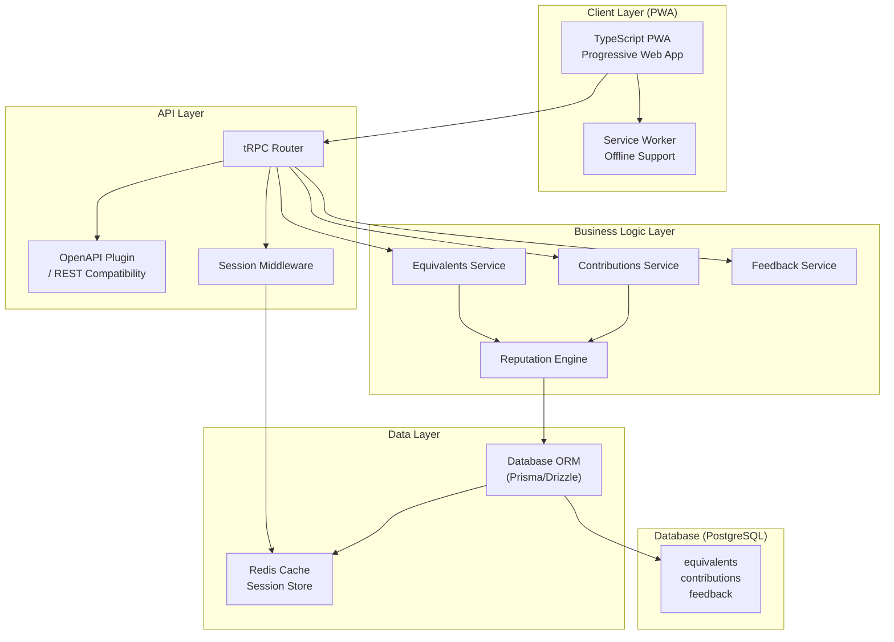

### 1.2 Component Responsibilities

| Component | Responsibility | Key Technologies |
|-----------|----------------|------------------|
| **PWA Client** | User interface, offline-capable browsing, service worker caching | TypeScript, Vite, Workbox |
| **tRPC Router** | Type-safe API routing, procedure definitions | tRPC v11 |
| **OpenAPI Plugin** | REST API compatibility, OpenAPI spec generation | @trpc/server/adapters/openapi |
| **Session Middleware** | Zero-attribution session management, hash verification | SHA-256 session tokens |
| **Equivalents Service** | CRUD for equivalent items, search, confidence scoring | Business logic |
| **Contributions Service** | Voting, reputation calculation, contribution tracking | Weighted voting algo |
| **Feedback Service** | Feedback submission, aggregation | Rating aggregation |
| **Reputation Engine** | Session-based reputation, confidence algorithms | Custom implementation |
| **Database ORM** | Type-safe database operations | Prisma or Drizzle |
| **PostgreSQL** | Persistent storage, full-text search | PostgreSQL 15+ |

### 1.3 Zero-Attribution Design Implementation

The zero-attribution design is fundamental to GDPR compliance and DAC7 exemption. Here's how it works:

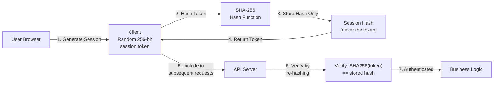

**Key Principles:**
- Never store the raw session token
- Token is generated client-side, server only sees the hash
- Session cannot be reverse-engineered to identify the user
- No login, no accounts, no personal data collection

---

## 2. Technology Stack Details

### 2.1 Technology Selection Rationale

| Layer | Technology | Justification |
|-------|------------|---------------|
| **Language** | TypeScript | Type safety end-to-end, shared types between client and server |
| **API Framework** | tRPC with OpenAPI plugin | Type-safe API, automatic REST compatibility via OpenAPI |
| **Database** | PostgreSQL | Robust relational data, full-text search, proven at scale |
| **ORM** | Prisma or Drizzle | Type-safe database access, migrations support |
| **Frontend** | TypeScript PWA | Offline capability, native-like experience |
| **Caching** | Redis | Session store, query cache for NFR compliance |
| **Deployment** | Docker + Container orchestration | Reproducible, scalable deployments |

### 2.2 Frontend Architecture (PWA)

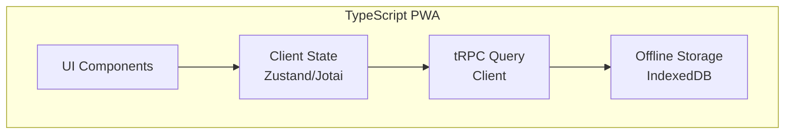

**PWA Requirements:**
- Service Worker for offline functionality
- Web App Manifest for installability
- Push notification support (future phase)
- Background sync for offline contributions

### 2.3 Backend Architecture

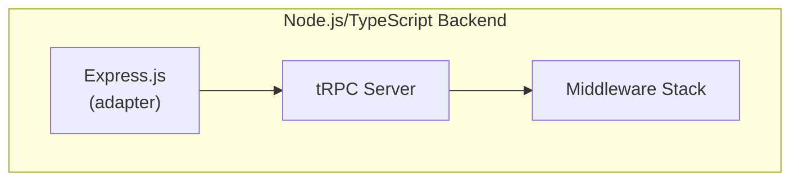

**Backend Specifications:**
- Node.js runtime (LTS version)
- Express.js adapter for tRPC
- Helmet for security headers
- Rate limiting middleware
- Request validation with Zod

### 2.4 Deployment Architecture

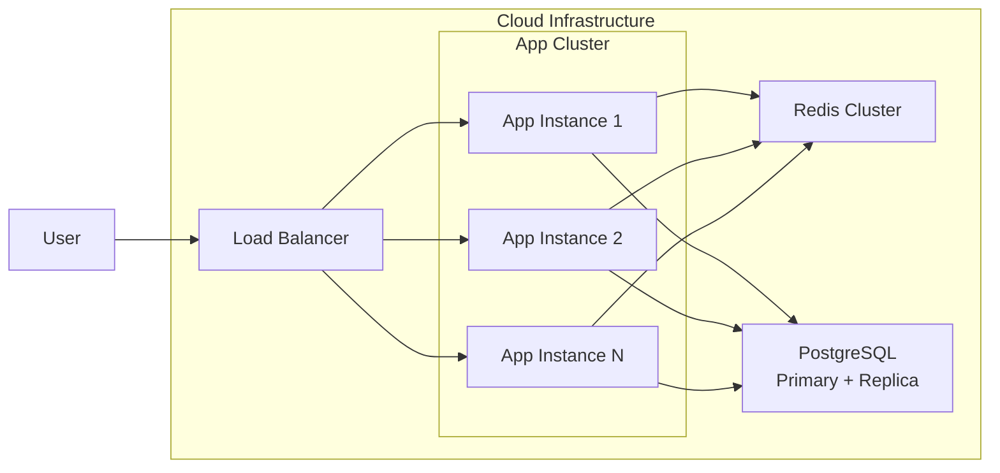

---

## 3. tRPC + OpenAPI Integration

### 3.1 Dual Protocol Support

The architecture supports both tRPC (internal/native) and REST (external/compatible) protocols:

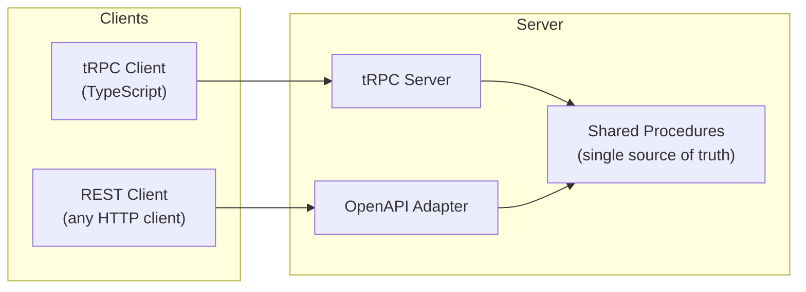

### 3.2 API Endpoints Mapping

The following table maps PRD requirements to tRPC procedures and REST endpoints:

| PRD Endpoint | tRPC Procedure | REST Equivalent | Description |
|--------------|----------------|-----------------|-------------|
| `GET /api/equivalents?search={query}` | `equivalents.search` | `GET /api/equivalents?search={query}` | Search equivalent items |
| `POST /api/equivalents` | `equivalents.create` | `POST /api/equivalents` | Create new equivalent |
| `POST /api/contributions/vote` | `contributions.vote` | `POST /api/contributions/vote` | Vote on contribution |
| `POST /api/feedback` | `feedback.submit` | `POST /api/feedback` | Submit feedback |

### 3.3 OpenAPI Specification

The OpenAPI plugin generates a complete REST API specification:

```yaml
openapi: 3.0.3
info:
  title: Trueque Canarias Social API
  version: 1.0.0
  description: REST API for Trueque Canarias - Zero-attribution bartering platform
servers:
  - url: https://api.truequecanarias.es
    description: Production server
paths:
  /api/equivalents:
    get:
      summary: Search equivalents
      parameters:
        - name: search
          in: query
          schema:
            type: string
          description: Search query
        - name: category
          in: query
          schema:
            type: string
          description: Category filter
      responses:
        '200':
          description: List of equivalents
          content:
            application/json:
              schema:
                $ref: '#/components/schemas/EquivalentList'
    post:
      summary: Create equivalent
      requestBody:
        required: true
        content:
          application/json:
            schema:
              $ref: '#/components/schemas/EquivalentInput'
      responses:
        '201':
          description: Created equivalent
          content:
            application/json:
              schema:
                $ref: '#/components/schemas/Equivalent'
  /api/contributions/vote:
    post:
      summary: Vote on contribution
      requestBody:
        required: true
        content:
          application/json:
            schema:
              $ref: '#/components/schemas/VoteInput'
      responses:
        '200':
          description: Vote recorded
  /api/feedback:
    post:
      summary: Submit feedback
      requestBody:
        required: true
        content:
          application/json:
            schema:
              $ref: '#/components/schemas/FeedbackInput'
      responses:
        '201':
          description: Feedback submitted
components:
  schemas:
    EquivalentList:
      type: object
      properties:
        items:
          type: array
          items:
            $ref: '#/components/schemas/Equivalent'
        total:
          type: integer
        confidence:
          type: number
    Equivalent:
      type: object
      properties:
        id:
          type: string
          format: uuid
        name:
          type: string
        category:
          type: string
        valueEstimate:
          type: number
        confidence:
          type: number
        createdAt:
          type: string
          format: date-time
    EquivalentInput:
      type: object
      required:
        - name
        - category
        - valueEstimate
      properties:
        name:
          type: string
        category:
          type: string
        valueEstimate:
          type: number
        description:
          type: string
    VoteInput:
      type: object
      required:
        - contributionId
        - vote
        - sessionToken
      properties:
        contributionId:
          type: string
          format: uuid
        vote:
          type: string
          enum: [UPVOTE, DOWNVOTE]
        sessionToken:
          type: string
    FeedbackInput:
      type: object
      required:
        - type
        - content
        - sessionToken
      properties:
        type:
          type: string
          enum: [BUG, SUGGESTION, PRAISE]
        content:
          type: string
        relatedItemId:
          type: string
          format: uuid
```

### 3.4 Session Token Handling

All authenticated endpoints require a `sessionToken` in the request body or header:

```typescript
// tRPC context includes session
interface Context {
  sessionHash: string | null; // SHA-256 hash of token
  sessionToken: string | null; // Raw token for generation only
}

// Middleware validates session
const sessionMiddleware = t.middleware(async ({ ctx, next }) => {
  const token = ctx.headers['x-session-token'];
  if (token) {
    const hash = crypto.createHash('sha256').update(token).digest('hex');
    return next({
      ctx: {
        ...ctx,
        sessionHash: hash,
        sessionToken: token,
      },
    });
  }
  return next({ ctx });
});
```

---

## 4. Database Schema (PostgreSQL)

### 4.1 Entity Relationship Diagram

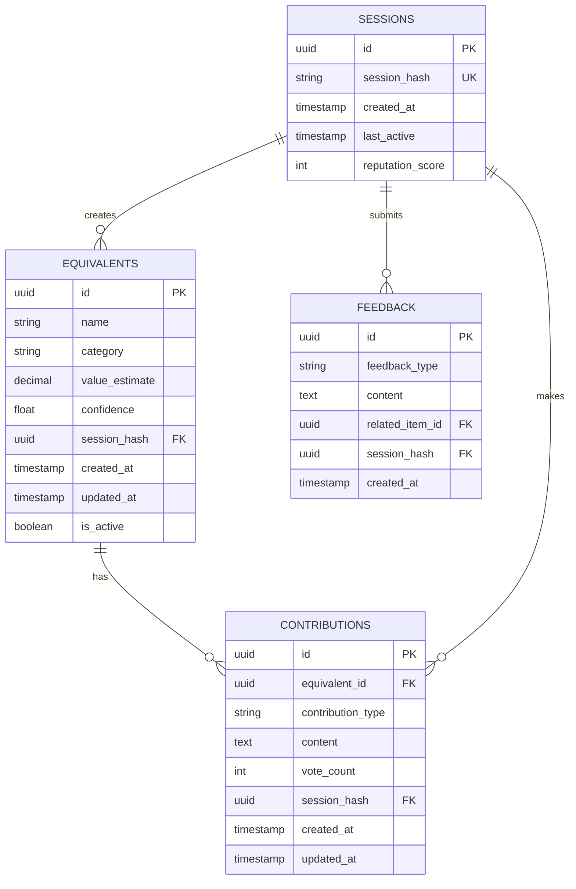

### 4.2 Table Definitions

#### 4.2.1 Sessions Table (Zero-Attribution)

```sql
CREATE TABLE sessions (
    id UUID PRIMARY KEY DEFAULT gen_random_uuid(),
    session_hash VARCHAR(64) UNIQUE NOT NULL,  -- SHA-256 hash, never the token
    created_at TIMESTAMP WITH TIME ZONE DEFAULT NOW(),
    last_active TIMESTAMP WITH TIME ZONE DEFAULT NOW(),
    reputation_score INTEGER DEFAULT 0,
    is_active BOOLEAN DEFAULT true
);

CREATE INDEX idx_sessions_hash ON sessions(session_hash);
CREATE INDEX idx_sessions_reputation ON sessions(reputation_score DESC);
```

**Note:** This table stores only hashes, not actual session tokens. The token exists only in the user's browser.

#### 4.2.2 Equivalents Table

```sql
CREATE TABLE equivalents (
    id UUID PRIMARY KEY DEFAULT gen_random_uuid(),
    name VARCHAR(255) NOT NULL,
    category VARCHAR(100) NOT NULL,
    value_estimate DECIMAL(12, 2) NOT NULL,
    description TEXT,
    confidence DECIMAL(5, 4) DEFAULT 0.0,  -- 0.0000 to 1.0000
    session_hash VARCHAR(64) REFERENCES sessions(session_hash),
    created_at TIMESTAMP WITH TIME ZONE DEFAULT NOW(),
    updated_at TIMESTAMP WITH TIME ZONE DEFAULT NOW(),
    is_active BOOLEAN DEFAULT true
);

-- Full-text search index
CREATE INDEX idx_equivalents_search ON equivalents 
    USING GIN (to_tsvector('spanish', name || ' ' || COALESCE(description, '')));

-- Category optimization
CREATE INDEX idx_equivalents_category ON equivalents(category);

-- Confidence-based queries
CREATE INDEX idx_equivalents_confidence ON equivalents(confidence DESC);

-- Session-based queries
CREATE INDEX idx_equivalents_session ON equivalents(session_hash);
```

#### 4.2.3 Contributions Table

```sql
CREATE TABLE contributions (
    id UUID PRIMARY KEY DEFAULT gen_random_uuid(),
    equivalent_id UUID REFERENCES equivalents(id) ON DELETE CASCADE,
    contribution_type VARCHAR(50) NOT NULL,  -- 'CORRECTION', 'ADDITION', 'DISPUTE'
    content TEXT NOT NULL,
    vote_count INTEGER DEFAULT 0,
    session_hash VARCHAR(64) REFERENCES sessions(session_hash),
    created_at TIMESTAMP WITH TIME ZONE DEFAULT NOW(),
    updated_at TIMESTAMP WITH TIME ZONE DEFAULT NOW(),
    is_accepted BOOLEAN DEFAULT false
);

-- Query optimization
CREATE INDEX idx_contributions_equivalent ON contributions(equivalent_id);
CREATE INDEX idx_contributions_session ON contributions(session_hash);
CREATE INDEX idx_contributions_votes ON contributions(vote_count DESC);
CREATE INDEX idx_contributions_type ON contributions(contribution_type);
```

#### 4.2.4 Feedback Table

```sql
CREATE TABLE feedback (
    id UUID PRIMARY KEY DEFAULT gen_random_uuid(),
    feedback_type VARCHAR(50) NOT NULL,  -- 'BUG', 'SUGGESTION', 'PRAISE'
    content TEXT NOT NULL,
    related_item_id UUID,  -- Optional reference to equivalent/contribution
    session_hash VARCHAR(64) REFERENCES sessions(session_hash),
    created_at TIMESTAMP WITH TIME ZONE DEFAULT NOW(),
    status VARCHAR(20) DEFAULT 'PENDING'  -- 'PENDING', 'REVIEWED', 'ADDRESSED'
);

-- Query optimization
CREATE INDEX idx_feedback_type ON feedback(feedback_type);
CREATE INDEX idx_feedback_session ON feedback(session_hash);
CREATE INDEX idx_feedback_created ON feedback(created_at DESC);
```

### 4.3 Database Migrations Strategy

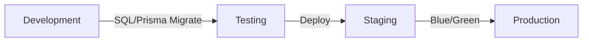

- Use Prisma or Drizzle for type-safe migrations
- Always use transactions for schema changes
- Maintain down migrations for rollback capability
- Seed data for development and testing

---

## 5. Security & Compliance Architecture

### 5.1 Zero-Attribution Implementation

**Core Principle:** No personally identifiable information (PII) is stored or can be derived.

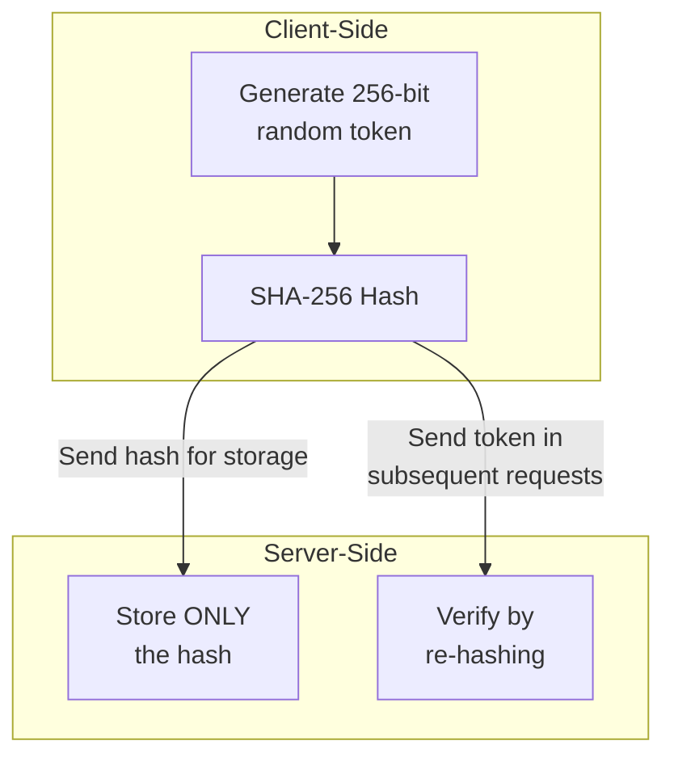

**Implementation Details:**

1. **Token Generation (Client):**
   ```typescript
   // Generate cryptographically secure random token
   const token = crypto.randomBytes(32).toString('hex');
   // 256-bit entropy, effectively unguessable
   ```

2. **Hash Storage (Server):**
   ```typescript
   // Server NEVER sees or stores the raw token
   const hash = crypto.createHash('sha256').update(token).digest('hex');
   // Store only: 64-character hex string
   ```

3. **Session Verification:**
   ```typescript
   // Re-verify on each request
   const providedToken = req.headers['x-session-token'];
   const computedHash = crypto.createHash('sha256').update(providedToken).digest('hex');
   // Compare against stored hash - O(1) lookup
   ```

### 5.2 GDPR Compliance Architecture

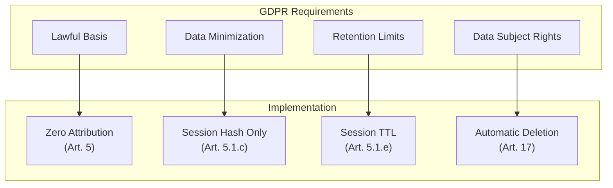

| GDPR Article | Requirement | Implementation |
|--------------|-------------|----------------|
| Art. 5(1)(b) | Purpose limitation | Data used only for reputation and content contribution |
| Art. 5(1)(c) | Data minimization | Only session hash stored, no PII |
| Art. 5(1)(e) | Storage limitation | Sessions auto-expire after 90 days of inactivity |
| Art. 5(1)(f) | Integrity and confidentiality | HTTPS, hash verification, rate limiting |
| Art. 17 | Right to erasure | Automatic - no PII means nothing to erase |

### 5.3 DAC7 Compliance

The platform qualifies for DAC7 exemption because:

1. **Pure Information Utility:** The platform is a "pure calculator" - it calculates equivalent values without facilitating actual transactions
2. **No Payment Processing:** No money changes hands through the platform
3. **No Marketplace:** Users do not buy or sell through the platform
4. **Information Only:** The service provides information about value equivalence, not commercial transactions

**Documentation Requirement:** Maintain records demonstrating:
- No transaction facilitation
- No payment processing capability
- No seller/buyer matching
- Pure information/calculation purpose

### 5.4 Security Measures

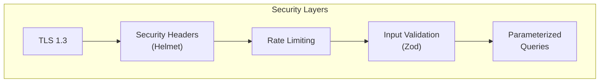

| Security Measure | Implementation |
|------------------|----------------|
| **Transport Security** | TLS 1.3, HSTS enabled |
| **Security Headers** | Helmet.js with strict CSP |
| **Rate Limiting** | 100 requests/minute per IP, 1000/hour per session |
| **Input Validation** | Zod schemas on all inputs |
| **SQL Injection** | ORM with parameterized queries |
| **XSS Protection** | Content Security Policy, input sanitization |
| **CORS** | Strict origin allowlist |

---

## 6. Scalability & Performance

### 6.1 Non-Functional Requirements (from PRD)

| NFR | Target | Architecture Support |
|-----|--------|----------------------|
| **API Response Time** | < 200ms p95 | Redis caching, indexed queries |
| **Page Load Time** | < 500ms p95 | CDN, PWA caching, optimized bundles |
| **Concurrent Users** | 500+ | Horizontal scaling, stateless design |
| **Availability** | 99.5% | Load balancing, health checks, graceful degradation |
| **Database** | 10k+ equivalents | Indexing, query optimization |

### 6.2 Caching Strategy

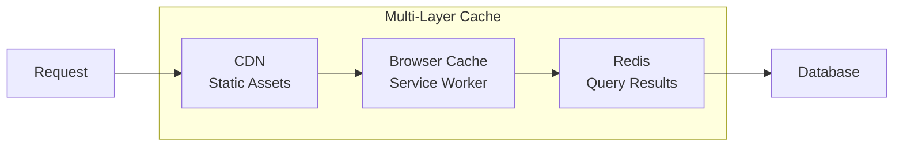

**Cache Layers:**

| Layer | TTL | Invalidation |
|-------|-----|--------------|
| CDN (static) | 1 hour | Version-based |
| Browser (PWA) | Session | Service worker update |
| Redis (queries) | 5 minutes | On write |
| Redis (session) | Session lifetime | Expiry |

### 6.3 Horizontal Scaling Approach

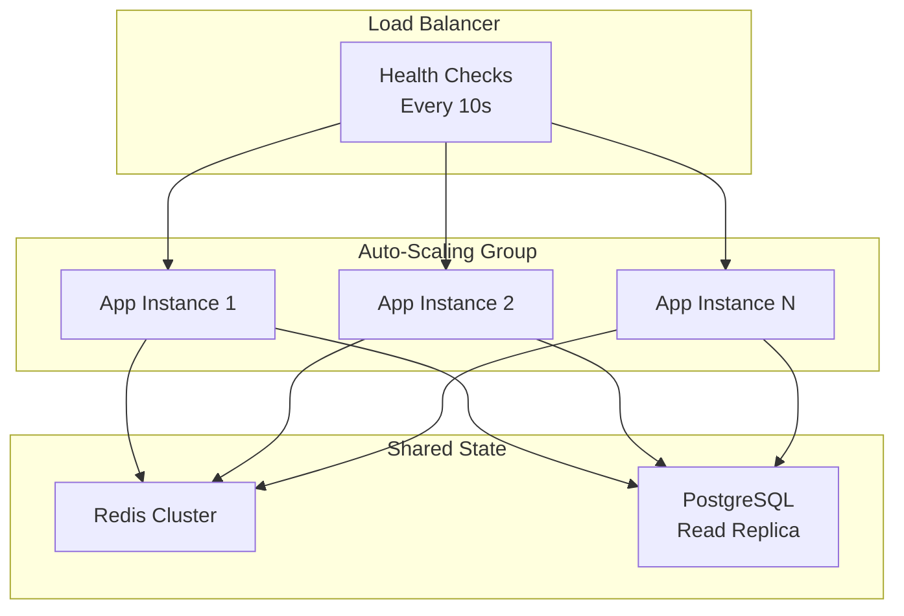

**Scaling Triggers:**
- CPU > 70% for 2 minutes → Add instance
- CPU < 30% for 5 minutes → Remove instance
- Request queue > 100 → Add instance
- Min instances: 2, Max instances: 10

### 6.4 Performance Optimizations

| Optimization | Implementation |
|--------------|----------------|
| **Database Indexing** | Covering indexes on frequently queried columns |
| **Query Optimization** | N+1 prevention, connection pooling |
| **CDN Offloading** | Static assets served from CDN |
| **Bundle Optimization** | Code splitting, tree shaking |
| **Database Connection Pool** | PgBouncer or built-in pooler |
| **Read Replicas** | PostgreSQL read replica for queries |

### 6.5 Monitoring & Observability

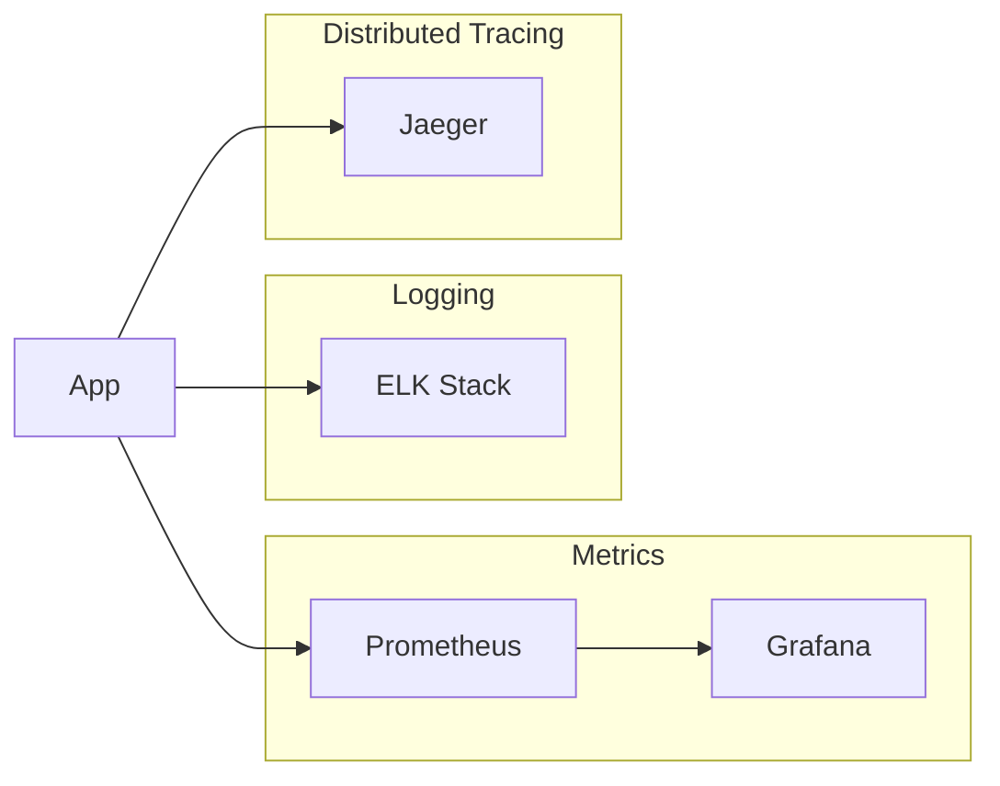

**Key Metrics to Monitor:**
- API latency (p50, p95, p99)
- Error rate
- Active sessions
- Database query time
- Cache hit rate
- CPU/Memory utilization

---

## 7. Implementation Readiness Checklist

Before proceeding to Phase 4 (Implementation), verify:

- [ ] **PRD Alignment:** All 9 functional requirements mapped to procedures
- [ ] **API Contract:** OpenAPI spec covers all 4 endpoints
- [ ] **Database Schema:** All tables, indexes, and constraints defined
- [ ] **Security Review:** Zero-attribution design verified
- [ ] **Compliance:** GDPR and DAC7 exemption documented
- [ ] **NFR Compliance:** Architecture supports <200ms API, <500ms page load, 500+ users
- [ ] **Tech Stack:** TypeScript, tRPC, PostgreSQL stack validated

---

## 8. Architecture Decision Records

### ADR-001: Technology Stack Selection

**Decision:** TypeScript + tRPC + PostgreSQL

**Rationale:**
- TypeScript provides end-to-end type safety
- tRPC eliminates API contract drift between client and server
- OpenAPI plugin enables REST compatibility for external integrations
- PostgreSQL provides robust relational data with full-text search

**Alternatives Considered:**
- REST-only API: Rejected due to type safety loss
- GraphQL: Rejected for MVP simplicity, over-engineering risk
- NoSQL (MongoDB): Rejected, relational model better fits structured equivalents data

### ADR-002: Zero-Attribution Design

**Decision:** Client-side token generation with SHA-256 hash storage

**Rationale:**
- GDPR compliance without complexity of consent management
- DAC7 exemption requires no commercial transaction facilitation
- Session-based reputation provides community quality control
- No user accounts = no PII liability

**Alternatives Considered:**
- Cookie-based sessions: Rejected, still tied to browser fingerprinting risk
- OAuth/Social login: Rejected, introduces PII contrary to project goals
- Anonymous feedback only: Rejected, no community reputation mechanism

### ADR-003: Database Design

**Decision:** PostgreSQL with session hash as foreign key

**Rationale:**
- Relational integrity for contributions and feedback
- Full-text search via pg_trgm or GIN indexes
- Mature ORM support (Prisma/Drizzle)
- Proven at scale with active community

**Alternatives Considered:**
- SQLite: Rejected, not suitable for concurrent multi-instance deployment
- NoSQL: Rejected, relational model is correct fit
- Managed DB (Supabase): Rejected, self-hosted preferred for compliance control

---

## 9. Appendix

### A. API Request/Response Examples

#### Search Equivalents

```http
GET /api/equivalents?search=horas+de+jardiner%C3%ADa HTTP/1.1
Host: api.truequecanarias.es
Accept: application/json

HTTP/1.1 200 OK
Content-Type: application/json

{
  "items": [
    {
      "id": "550e8400-e29b-41d4-a716-446655440000",
      "name": "Hora de jardinería",
      "category": "servicios",
      "valueEstimate": 25.00,
      "confidence": 0.85,
      "createdAt": "2026-03-27T10:00:00Z"
    }
  ],
  "total": 1,
  "confidence": 0.85
}
```

#### Create Equivalent

```http
POST /api/equivalents HTTP/1.1
Host: api.truequecanarias.es
Content-Type: application/json

{
  "name": "Hora de reparaciones del hogar",
  "category": "servicios",
  "valueEstimate": 30.00,
  "description": "Reparaciones básicas de fontanería, electricidad o carpintería",
  "sessionToken": "abc123..."
}

HTTP/1.1 201 Created
Content-Type: application/json

{
  "id": "550e8400-e29b-41d4-a716-446655440001",
  "name": "Hora de reparaciones del hogar",
  "category": "servicios",
  "valueEstimate": 30.00,
  "confidence": 0.5,
  "createdAt": "2026-03-27T10:30:00Z"
}
```

#### Vote on Contribution

```http
POST /api/contributions/vote HTTP/1.1
Host: api.truequecanarias.es
Content-Type: application/json

{
  "contributionId": "550e8400-e29b-41d4-a716-446655440002",
  "vote": "UPVOTE",
  "sessionToken": "abc123..."
}

HTTP/1.1 200 OK
Content-Type: application/json

{
  "success": true,
  "newVoteCount": 5
}
```

#### Submit Feedback

```http
POST /api/feedback HTTP/1.1
Host: api.truequecanarias.es
Content-Type: application/json

{
  "type": "SUGGESTION",
  "content": "Sería útil poder filtrar por provincia",
  "sessionToken": "abc123..."
}

HTTP/1.1 201 Created
Content-Type: application/json

{
  "id": "550e8400-e29b-41d4-a716-446655440003",
  "status": "PENDING",
  "createdAt": "2026-03-27T10:35:00Z"
}
```

### B. Error Response Examples

```json
{
  "error": {
    "code": "VALIDATION_ERROR",
    "message": "Invalid input",
    "details": [
      {
        "path": "name",
        "message": "Required field missing"
      }
    ]
  }
}
```

```json
{
  "error": {
    "code": "NOT_FOUND",
    "message": "Equivalent item not found",
    "details": {
      "itemId": "550e8400-e29b-41d4-a716-446655440000"
    }
  }
}
```

```json
{
  "error": {
    "code": "RATE_LIMITED",
    "message": "Too many requests",
    "details": {
      "retryAfter": 60
    }
  }
}
```

---

**Document Version:** 1.0  
**Status:** Approved for Implementation  
**Next Phase:** Phase 4 - Implementation & Stories
